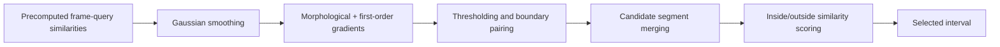

# FTF-VTG — Frame-Based Training-Free Video Temporal Grounding

**Locate a video moment by analyzing a frame–query similarity curve, without additional model training.**

Research by **Jiheon Kang, S. Kim, H. Noh, and H. Yang**, presented in the author's CV as *Maximizing Frame-Level Video Understanding for Efficient Video Temporal Grounding*, IEIE Summer Annual Conference, 2025.

이 저장소는 프레임과 질의 사이의 유사도 곡선에서 시간 구간을 찾는 연구 구현입니다. 복구한 로컬 백업과 기존 GitHub 구현이 일치함을 확인하고, 실행 경로와 데이터 의존성을 정리했습니다. 원본 비디오에서 유사도를 추출하는 VLM은 포함하지 않습니다.

[Research portfolio](https://heoneyzi.github.io/#publications)

## What this implementation does



The public entry point accepts a single finite similarity curve and returns inclusive sample indices, or `(None, None)` when no event boundary pair is found. Convert indices to seconds using the sampling rate of **your similarity curve**. Raw-video FPS is appropriate only when there is one score per original frame.

## Quick start

Python 3.10+; CPU is sufficient for the included synthetic example.

```bash
python3 -m venv .venv
source .venv/bin/activate
python -m pip install -r requirements.txt
python -m ftf_vtg --demo
```

The demo uses a generated low–high–low curve. It needs no model, API key, dataset, or GPU. It is a functionality check, **not a research benchmark**.

```python
from ftf_vtg import FTF_VTG
start, end = FTF_VTG([0.1] * 12 + [0.9] * 18 + [0.1] * 12)
print(start, end)
```

For your own JSON array or an object containing a `similarities` array:

```bash
python -m ftf_vtg --scores scores.json --theta-high 0.1 --output prediction.json
```

`python test.py` forwards to the same CLI. Use `python -m ftf_vtg --help` for all options.

## Evaluate precomputed dataset files

Use fixed hyperparameters selected on a separate validation split. This release does not tune automatically on a test set.

```bash
python -m ftf_vtg --task vmr_didemo --data-dir data/vmr_DiDeMo_json
python -m ftf_vtg --task vtg_didemo --data-dir data/vtg_DiDeMo_json --ground-truth data/didemo_ground_truth.json
python -m ftf_vtg --task vtg_vidstg --data-dir data/vtg_VidSTG_json
```

Each directory must contain per-example JSON files:

| Task | Expected fields |
| --- | --- |
| DiDeMo VMR | `similarities`, `fps`, `total_frames`, `num_segments`, `gt_times` (pairs of 0-based, inclusive five-second segment indices) |
| DiDeMo VTG | `similarities`, `video`, `query`, `fps`, `total_frames`; separate ground-truth JSON list with `video`, `description`, `times`, `num_segments` |
| VidSTG VTG | `used_segment.begin_fid/end_fid`, `ground.begin_fid/end_fid`, and `text_queries.description.similarities` indexed by original frame |

DiDeMo ground truth is matched by **both video and query**, preventing identically worded queries from different videos from sharing annotations. Examples with no prediction count as misses; malformed examples stop with a filename-specific error. Empty directories fail explicitly. These repairs affect evaluation accounting, so new results must not be equated with historical numbers without a fresh comparison.

The adapters preserve the original research code's sample-index endpoint conventions and DiDeMo candidate ranking; they are **not official benchmark evaluator replacements**. VMR reports Recall@1/@5; VTG reports mean IoU and recall at IoU ≥ 0.5.

### Data access

No video, dataset, learned weights, or API credentials are included. Acquire original datasets under their terms. The original repository supplied these processed-data references; they are retained as historical pointers and their availability/schema has not been revalidated:

- [DiDeMo VMR processed JSON](https://drive.google.com/file/d/1yalJNKS3c46drcDbSw5o5pgmmYJtPWQ6/view?usp=share_link)
- [DiDeMo VTG processed JSON](https://drive.google.com/file/d/1GE7DQLhf4Iw6SNFr-xnqjIamyg671s-1/view?usp=share_link)
- [VidSTG VTG processed JSON](https://drive.google.com/file/d/1kHJLY3aDLRlRJrpBBOtRIDPfl2lZcSTQ/view?usp=share_link)

## Repository map

- `ftf_vtg/main.py`: supported inference function and input validation
- `segment_detector.py`, `segment_merger.py`, `segment_scorer.py`: original modular algorithm
- `ftf_vtg/__main__.py`: portable CLI
- `ftf_vtg/evaluation.py`: explicit, fixed-parameter dataset adapters
- `ftf_vtg/experiment/`: thin task-specific wrappers; no import-time data loading
- `ftf_vtg/src/model/FTF_VTG.py`: historical monolithic variant, retained for provenance; use the public package entry point for maintained behavior
- `tests/test_portable.py`: synthetic inference, invalid/flat input, numerical stability, import safety, missing-prediction counting, and ground-truth identity tests

## Validation and limits

```bash
python -m pip install pytest
python -m pytest -q tests
```

The September 2026 maintenance release checks the portable implementation with synthetic inputs. It does **not** rerun DiDeMo/VidSTG research experiments or substantiate the older README's “under 1 GB”/“up to 61% improvement” claims. Hardware, processed features, final hyperparameters, and exact evaluation IDs are needed to reproduce historical results.

The source backup matches the pre-maintenance public Python files byte-for-byte. Original repository history is preserved; no authorship is claimed over external VLMs or datasets. No repository-wide license was present, so this maintenance release does not add one on behalf of coauthors.
